# 🚗 HOMIE (real estate) Application

A full-stack web application for managing real estate listings and inquiries,built with **Next.js**, **PostgreSQL**, **Prisma**, **NextAuth** and **Tailwind CSS**.


🚀 Built with modern web technologies to streamline property management for users, agents, and admins.

---

## 🌐 Live Demo
🔗 [View Live Project](https://homie-xi.vercel.app)

---

## 📸 Screenshots

### Homepage
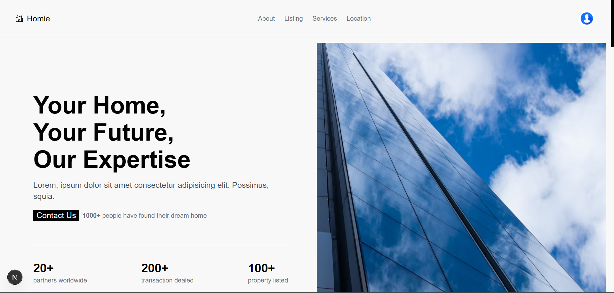

### Listing page
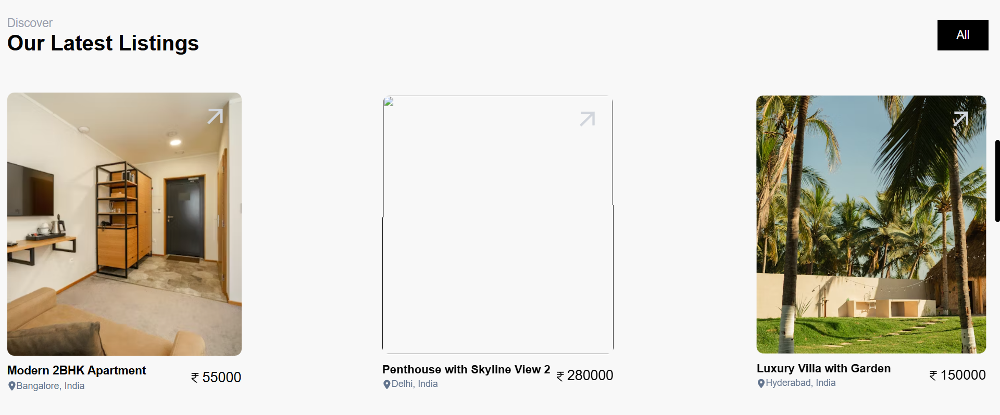

### Listing Details
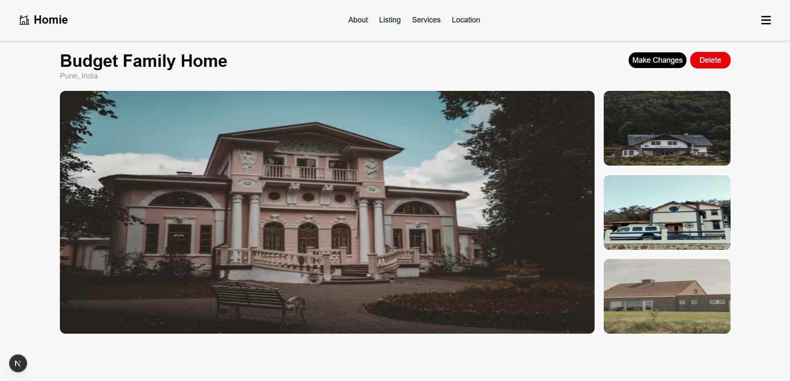

### Feature
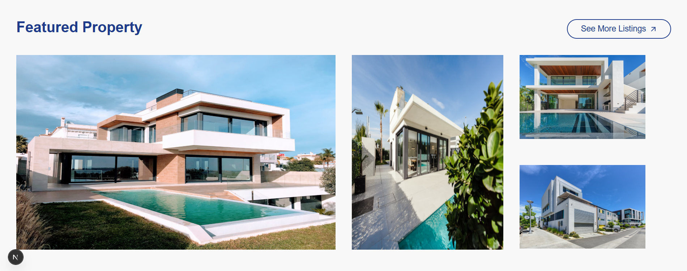

### Services
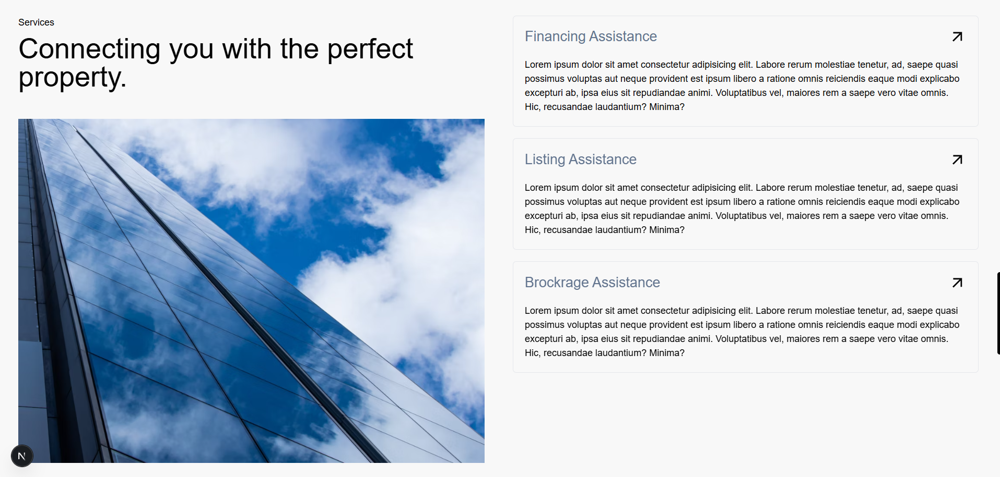

### Locations 


### Signin
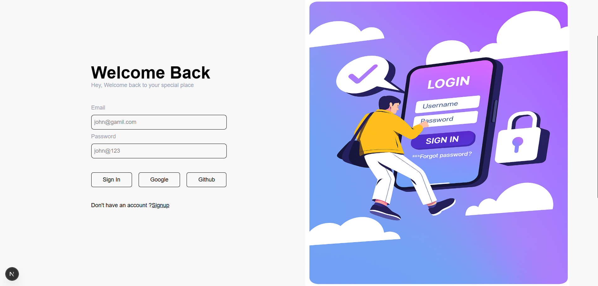

### Signup
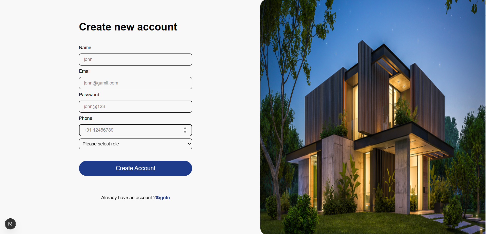

### Listing post 
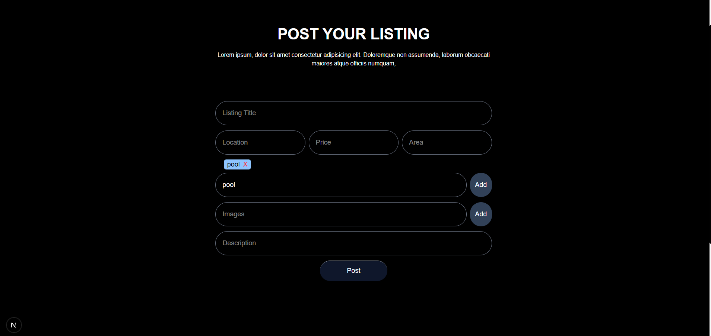

### Admin Dashboard
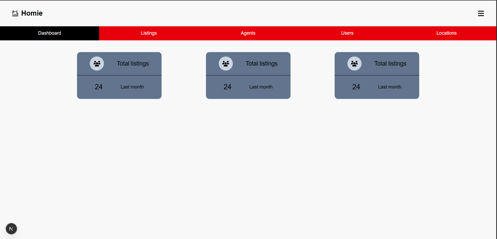

### Inquiry
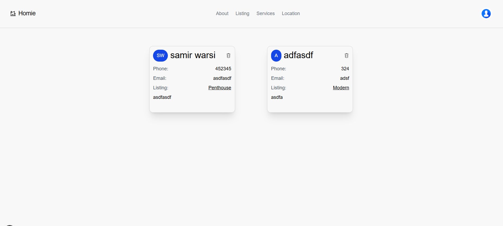

### Map from the listing location 
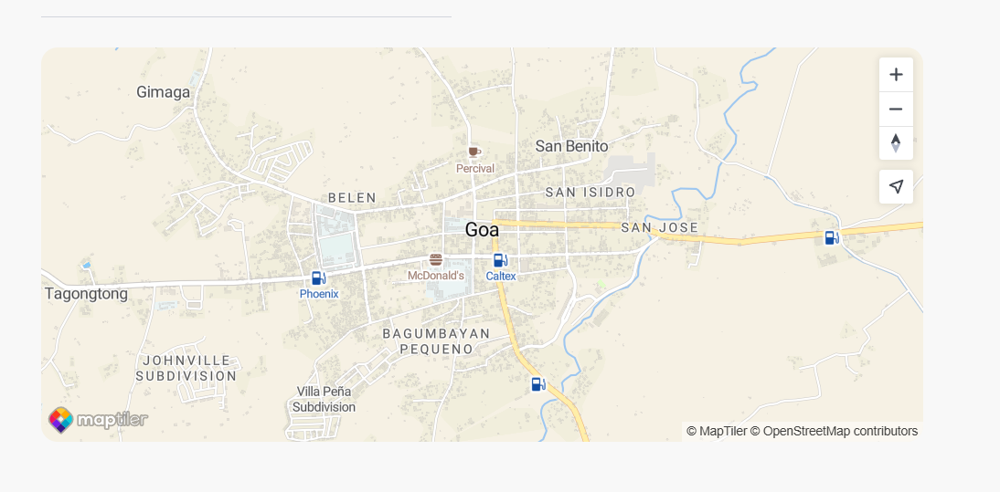


---

## 📋 Features

- 🔐 **User Authentication** with **NextAuth** (Google GitHub & Email login)
- 📅 **Real-time Booking System** with Prisma & PostgreSQL
- 📱 Fully Responsive with **Tailwind CSS**
- 🔄 **Admin Dashboard** to manage everything 
- ✨ Smooth animations with **Framer Motion**
- 🔔 Toast notifications via **React Hot Toast**

---

## 🛠️ Tech Stack
**Frontend:** Next.js, Tailwind CSS, Framer Motion, React Icons  
**Backend:** Next.js API Routes, Prisma ORM  
**Database:** PostgreSQL  
**Auth:** NextAuth  
**Security:** Bcrypt for password hashing  
**Notifications:** React Hot Toast

---

## 📦 Installation

### 1️⃣ Clone the repository
```bash
git clone https://github.com/warsi0707/Homie

npm install

npx prisma migrate dev --name init

npm run dev
```

